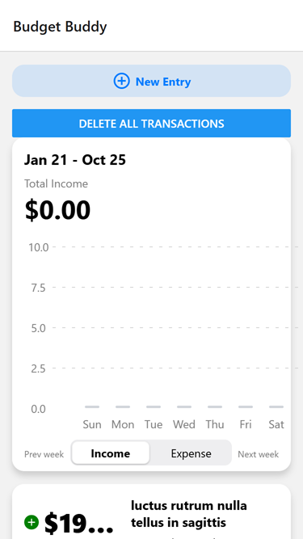
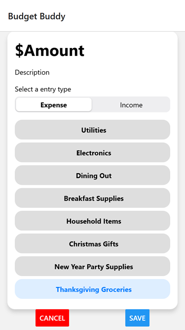

# Budget Buddy App

## Introduction

Budget Buddy App, a real-world budget management application built with SQLite and Expo 50. This project demonstrates the power of developing local-first applications that manage complex data structures with instant performance for CRUD operations.

### About the App

This app is designed to help users manage their finances effectively using the robustness of SQLite for data management. With its user-friendly interface and powerful backend, Budget Buddy makes budgeting simple and efficient.

## Features

- User-friendly budget tracking
- Instant performance for CRUD operations
- Local-first data management with SQLite
- Built with TypeScript and Expo 50

## Technologies Used

- **Language:** TypeScript
- **Framework:** Expo 50
- **Database:** SQLite
- **Project Type:** Mobile

## Prerequisites

```yaml
node.js: 20.19.4
```

## Getting Started

```bash
npm i

npm run web
```

It will open http://localhost:8081/

## Screenshots




